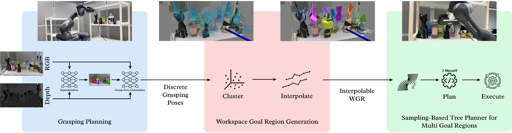

# Lazy Evaluation of Multi-Grasp Goals Guided by Motion Planning in Pick-and-Place Object Manipulation

**Furkan Duman, Emin Safa Tok, Juan Hernández**


<p align="center">
  
</p>

## Abstract

Pick and place operations are part of the fundamental actions that enable robotic object manipulation in complex environments. Such operations present significant challenges, particularly when determining the grasp affordances of the objects of interest, and especially when calculating the robot motions to grasp such objects. A commonly used approach is to solve these two problems separately, i.e., grasp and motion planning. However, in cluttered environments, this separation can lead to issues where generated grasp poses are infeasible for the robot’s end-effector, resulting in inefficient searches. To address this, we propose a pipeline that integrates the capabilities of a grasp planner and motion planner to jointly solve manipulation tasks. Our approach proposes to explicitly represent the objects’ grasp affordances through continuous workspace goal regions (WGRs), which can approximate the goal regions (GRs) that are implicitly defined in the configuration space (C-Space). The result of doing this is an extended start-to-goal motion planning problem, which is solved with a sampling-based tree planner. Our pipeline not only improves the accuracy of grasping in complex environments but also significantly increases the success rate of manipulation tasks that involve pick and place operations in such settings. We validate the effectiveness of our approach through both simulation and real-robot experiments using the Franka Emika robotic manipulator.

## Video

For a detailed overview of our method and experiments, please watch our project video.

[](https://youtu.be/0_MltWxtiNw?si=N_kqMZ7Iijt_O-mA)

[**Watch on YouTube**](https://youtu.be/0_MltWxtiNw?si=N_kqMZ7Iijt_O-mA)

## Citation

If you find our work useful, please consider citing:

```bibtex
@article{duman2025lewgr,
    author    = {Duman, Furkan and Tok, Emin Safa and Hernandez-Vega, Juan},
    title     = {Lazy Evaluation of Multi-Grasp Goals Guided by Motion Planning in Pick-and-Place Object Manipulation},
    journal   = {-},
    year      = {2026},
}
```